Clinical Genomic Profiling in the Management of Patients with Soft
Tissue and Bone Sarcoma
================

``` r
library(dplyr)
```

    ## 
    ## Attaching package: 'dplyr'

    ## The following objects are masked from 'package:stats':
    ## 
    ##     filter, lag

    ## The following objects are masked from 'package:base':
    ## 
    ##     intersect, setdiff, setequal, union

``` r
library(ggplot2)
library(ggrepel)
library(reshape2)
library(readxl)
library(dplyr)
library(stringr)
library(ggridges)
library(ggalluvial)
library(egg)
```

    ## Loading required package: gridExtra

    ## 
    ## Attaching package: 'gridExtra'

    ## The following object is masked from 'package:dplyr':
    ## 
    ##     combine

``` r
library(grid)
```

``` r
fontsize <- 8

base_breaks_x <- function(x){
  b <- pretty(x)
  b <- replace(b, length(b), max(x)) 
  d <- data.frame(y=-Inf, yend=-Inf, x=min(b), xend=max(b))
  list(geom_segment(data=d, aes(x=x, y=y, xend=xend, yend=yend), inherit.aes=FALSE),
       scale_x_continuous(breaks=b))
}
base_breaks_y <- function(x){
  b <- pretty(x)
  b <- replace(b, length(b), max(x))
  d <- data.frame(x=-Inf, xend=-Inf, y=min(b), yend=max(b))
  list(geom_segment(data=d, aes(x=x, y=y, xend=xend, yend=yend), inherit.aes=FALSE),
       scale_y_continuous(breaks=b))
}

give.n <- function(x){
return(c(y = max(x)*1.05, label = length(x))) 
}

reorder_within <- function(x, by, within, fun = mean, sep = "___", ...) {
  new_x <- paste(x, within, sep = sep)
  stats::reorder(new_x, by, FUN = fun)
}

scale_x_reordered <- function(..., sep = "___") {
  reg <- paste0(sep, ".+$")
  ggplot2::scale_x_discrete(labels = function(x) gsub(reg, "", x), ...)
}
```

FIG1A

``` r
dat<-read.table(file="src/fig1a_data.txt", header=T, sep="\t", strip.white=T, na.strings=c("","NA","N/A"),row.names=NULL)

dat$Disease<-factor(dat$Disease, levels=dat$Disease[order(dat$Percent, decreasing=TRUE)])

colorList<-c("bone"="#64CCC9", "soft tissue sarcoma"="#FF4C00", "other"="#435363")
nameList<-c( "bone"="Bone", "soft tissue sarcoma"="Soft Tissue", "other"="Other")

p<-ggplot(dat, 
          aes(x=Disease, y=Percent,fill=Group)) + 
  geom_bar(width=0.5, position=position_dodge(width = 0.6), stat="identity") +
  theme_classic()+
  scale_fill_manual(values=colorList, name="Group", labels=nameList) +
  scale_color_manual(values=colorList, name="Group", labels=nameList) +
  theme(
    axis.ticks=element_blank(),
    legend.position="bottom",
    legend.title = element_text(size=fontsize),
    legend.text = element_text(size=fontsize),
    axis.title.x = element_blank(),
    axis.text.x=element_text(angle=90, size=fontsize*1.25,colour="black",hjust=1),
    axis.text.y=element_text(size=fontsize*1.25,colour="black"),
    panel.border = element_rect(fill = NA, colour="black")) +
  xlab("Disease") +
  ylab("Percent Samples")+
  coord_cartesian(ylim =c(0, 20))

plot(p)
```

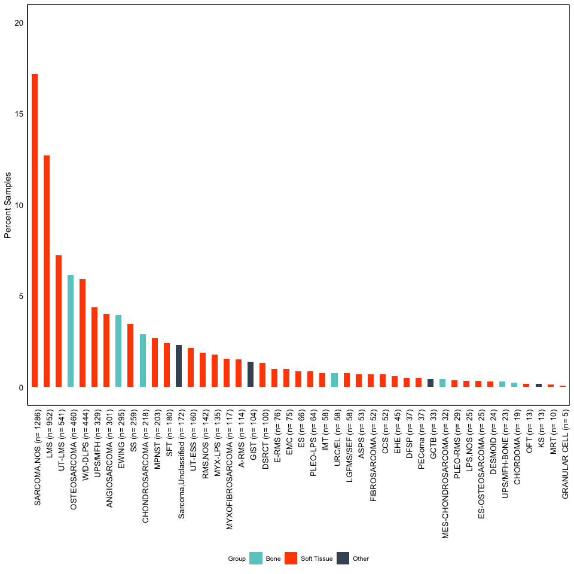<!-- -->

FIG1B

``` r
dat<-read.table(file="src/fig1b_data.txt",sep="\t",stringsAsFactors=FALSE,row.names=NULL,header=TRUE) %>% na.omit()

ggplot(dat, aes(x = age, y = final_disease, fill = final_disease)) + 
  geom_density_ridges(quantile_lines = TRUE, quantiles = 2) + 
  theme_classic() + 
  theme( legend.position = "none" ) + 
  scale_y_discrete( name = "" ) + 
  coord_cartesian(xlim = c(0,89))
```

    ## Picking joint bandwidth of 4.95

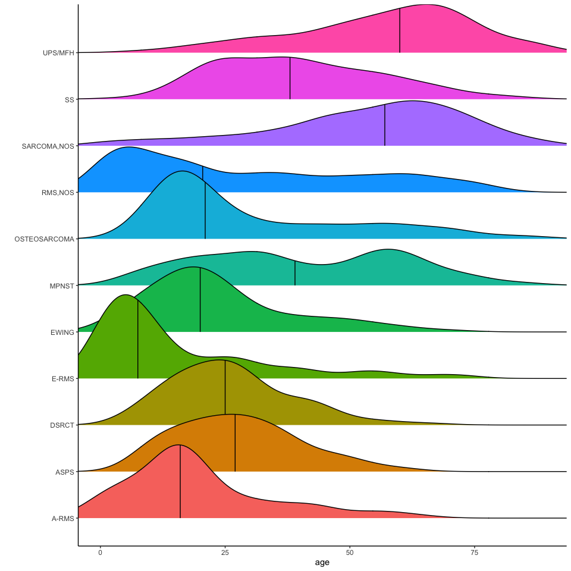<!-- -->

FIG1C

``` r
dat<-read.table(file="src/fig1c_data.txt",sep="\t",stringsAsFactors=FALSE,row.names=NULL,header=TRUE)

p<-ggplot(data = dat,
       aes(axis1 = Original, axis2 = Corrected,
           y = Counts)) +
  scale_x_discrete(limits = c("Original", "Corrected"), expand = c(.05, .05)) +
  geom_alluvium(aes(fill = Original)) +
  geom_stratum() + 
  geom_text(stat = "stratum", color = "black",
            aes(label = after_stat(stratum))) +
  theme_minimal() +
  theme(legend.position = "none")

plot(p)
```

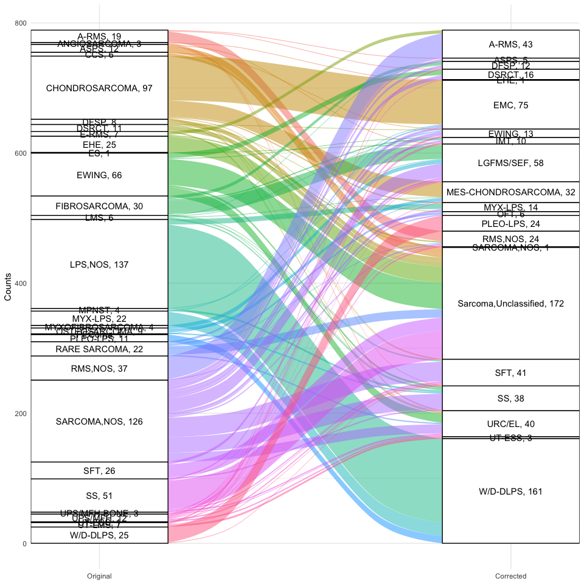<!-- -->

FIG2A

``` r
colorList <- c("Point Mutation/Indel"="salmon", 
               "Amplification"="deeppink",
               "Deletion"="skyblue",
               "Truncation"="steelblue4",
               "Fusion/Rearrangement"="gold3",
               "Amp & Point Mutation/Indel"="red",
               "Del & Truncation"="blue",
               "Amp & Fusion/Rearrangement"="yellow",
               "Other Multiple"="grey70",
               "Variant Present in sample" = "black")


dat <-read.table(file="src/fig2a-1_data.txt",sep="\t",stringsAsFactors=FALSE,row.names=NULL,header=TRUE)
alteredMat <-read.table(file="src/fig2a-2_data.txt",sep="\t",stringsAsFactors=FALSE,row.names=NULL,header=TRUE)

geneSortOrder <- unique(dat$Gene)
diseaseSortOrderTA <- dat %>% filter( Group == "translocation associated") %>% select(Disease) %>% unique() %>% unlist()
diseaseSortOrderOther <- dat %>% filter( Group == "other") %>% select(Disease) %>% unique() %>% unlist()
gggene<-ggplot(dat[dat$Group=="translocation associated",],aes(Disease,Gene))+
geom_tile(aes(fill=Frequency))+
scale_fill_gradient(name = "Frequency", low = "white", high = "#FF4C00",na.value = "steelblue" ,limits=c(0,1),labels=scales::percent) +
scale_y_discrete(limits = geneSortOrder) + 
  scale_x_discrete( limits = diseaseSortOrderTA) + 
theme_classic() +
theme(panel.grid.major = element_blank(),
      panel.grid.minor = element_blank(),
      panel.background = element_blank(),
      axis.ticks.x=element_blank(),
      legend.position="left",
      legend.title = element_text(size=fontsize),
      legend.text = element_text(size=fontsize),
      axis.title.y=element_text(size=fontsize),
      axis.text.x=element_text(size=fontsize,colour="black",angle=50,hjust=1,vjust=1),
      axis.text.y=element_text(size=fontsize,face="italic",colour="black"),
      panel.border = element_rect(fill = NA, colour="black")) +
ylab("") +
xlab("") +
ggtitle("Translocation-associated") 

gggene2<-ggplot(dat[dat$SuperGroup=="other",],aes(Disease,Gene))+
geom_tile(aes(fill=Frequency))+
scale_fill_gradient(name = "Frequency", low = "white", high = "#FF4C00",na.value = "steelblue" ,limits=c(0,1),labels=scales::percent_format(0)) +
scale_y_discrete(limits = geneSortOrder) +
  scale_x_discrete( limits = diseaseSortOrderOther) + 
theme_classic() +
theme(panel.grid.major = element_blank(),
      panel.grid.minor = element_blank(),
      panel.background = element_blank(),
      axis.ticks.x=element_blank(),
      axis.ticks.y=element_blank(),
      legend.position="none",
      legend.title = element_text(size=fontsize),
      legend.text = element_text(size=fontsize),
      axis.title.y=element_text(size=fontsize),
      axis.text.x=element_text(size=fontsize,colour="black",angle=50,hjust=1,vjust=1),
      axis.text.y=element_blank(),
      panel.border = element_rect(fill = NA, colour="black")) +
ylab("") +
xlab("") +
ggtitle("Genomically complex and other")


ggAlter<-ggplot(alteredMat, aes(x=Gene, y=Prevalence, fill=factor(variantType), width=0.95)) +
geom_bar(stat="identity") +
scale_fill_manual(values=colorList, name="Variant Type") +
theme_classic() + 
theme(axis.ticks=element_blank(),
      legend.position="right",
      legend.title = element_text(size=fontsize),
      legend.text = element_text(size=fontsize),
      axis.ticks.x = element_line(),
      axis.text.x=element_text(size=fontsize,colour="black", angle = 60, vjust = 1, hjust = 1),
      axis.text.y=element_blank(),
      axis.title.y=element_text(size=fontsize),
      axis.title.x=element_text(size=fontsize, angle = 60),
      panel.border = element_rect(fill = NA, colour="black")) +
  ylab("") + 
  scale_y_continuous(expand=c(0.0125,0),limits = c(0,0.5025),position = "left",labels = scales::percent_format(accuracy = 1L)) +
scale_x_discrete(position = "top",limits=unique(dat$Gene)) + 
xlab("Alteration\nFrequency") + 
guides(fill=guide_legend(ncol=1, title.position="top")) + 
ggtitle("") +
coord_flip()


ggarrange(gggene, gggene2, ggAlter,
         widths = c(6,10,2),
         heights = c(10.5),
         ncol=3,
         nrow=1)
```

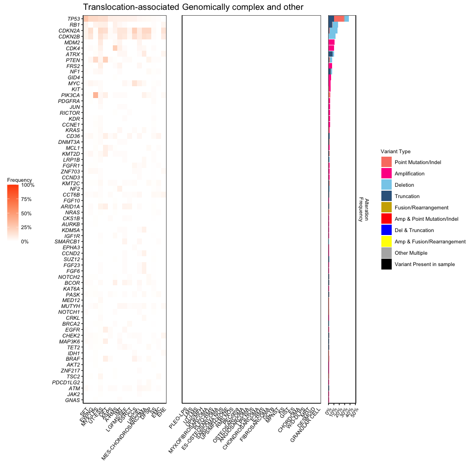<!-- -->

FIG2B

``` r
dat <- read.table("src/fig2b_data.txt", sep = "\t", header = T, row.names = NULL)

dat$geneGene <- paste(dat$gene1,dat$gene2,sep="\n")
colorlist = c("Cell cycle"="blue","P53 regulation"="red")


p<-ggplot(dat,aes(x=logOR, y=logFDR, color=pathway, label=geneGene))+
  geom_point(alpha=0.4)+ 
  theme_bw() +
  theme(axis.text.x = element_text(size=fontsize), 
        axis.text.y = element_text(size=fontsize), 
        axis.title = element_text(size=fontsize*1.25), 
        legend.position =c(0.67,0.9),
        panel.grid.major = element_blank(), 
        panel.grid.minor = element_blank(),
        legend.background = element_rect(fill='transparent')) +
  geom_hline(yintercept=-1*log10(0.05), linetype = "dashed") + 
  geom_vline(xintercept=0, linetype = "dashed") + 
  geom_text_repel(data = dat %>% arrange(fdr) %>% slice(1:10)%>% filter( fdr < 0.05),
                  segment.color = "grey50",
                  direction     = "both",
                  force=100,
                  nudge_y=0,
                  size = 3,
                  max.iter=1000,
                  show.legend = FALSE) +
  scale_x_continuous(limits = c(-5,5),oob=scales::squish)+ 
  scale_color_manual(name = "Pathway", values=colorlist)+
  labs(x=expression(log[2]('Odds Ratio')),y=expression(-log[10]('FDR')))

plot(p)
```

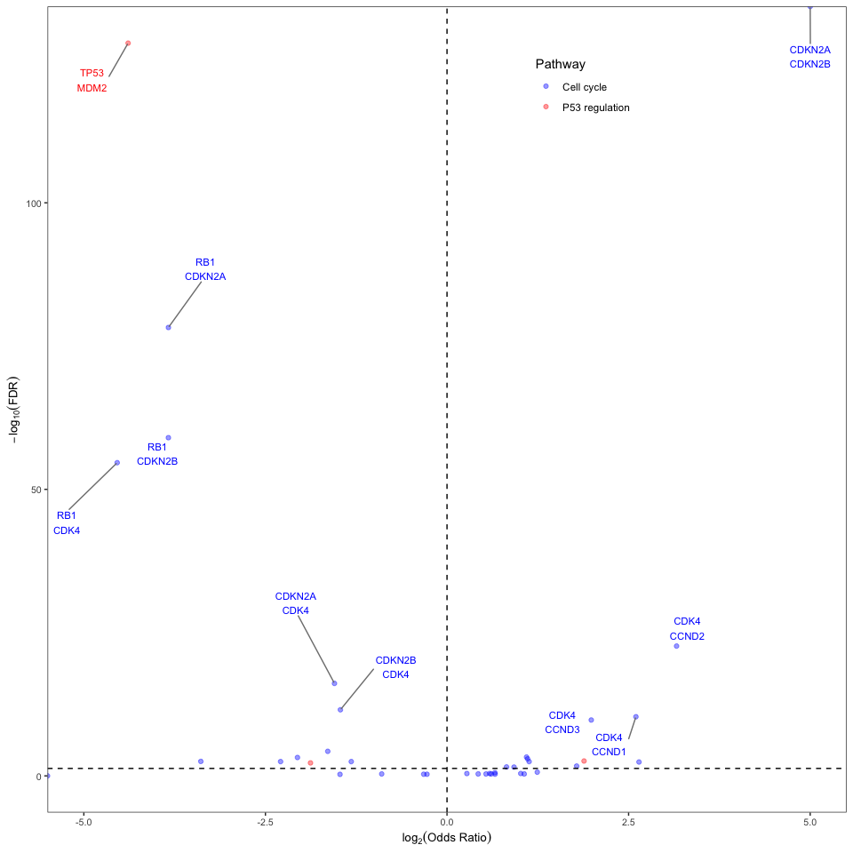<!-- -->

FIG3A

``` r
dat <- read.table("src/fig3a_data.txt", sep = "\t", header = T, row.names = NULL)
protein_info <- read.table("src/fig3_protein_data.txt", sep = "\t", header = T, row.names = NULL)

for (j in unique(dat$Transcript)){
  temp <- dat %>% filter( Transcript == j ) 
  temp2 <- protein_info %>% filter( Transcript == j ) 
  gene <- unique(temp$Gene)
  p <- ggplot() +
    geom_segment(data=temp,
                 aes(x=Codon, 
                      xend=Codon, 
                     y=-0.05, 
                     yend=2),#value), 
                 arrow = arrow(length = unit(0.2, "cm"),ends="first", type = "closed"),
                 color="black") +
    geom_segment(data = temp2,
                 aes(x = 0, xend = Protein.Length, 
                     y = -1, 
                     yend = -1), 
                 color = 'gray70', size = 2) +
    geom_rect(data = temp2[temp2$Name=='exon',], 
              aes(xmin = Domain.Start, 
                  xmax = Domain.End, 
                  ymin = -0.75, 
                  ymax = -1.25, 
                  ),fill = "grey90",color="black") +
    geom_rect(data = temp2[temp2$Name!='exon',], 
        aes(xmin = Domain.Start, 
            xmax = Domain.End, 
            ymin = -0.5, 
            ymax = -1.5, 
            fill = Full.Name),alpha=0.5,color="black") +
    geom_text_repel(data = temp2[temp2$Name!='exon',], 
              aes(x = Text.x, 
                  y = -2, 
                  label = Full.Name),direction="x",force = 0.0037,max.iter = 3e3)+
    theme_bw() +
    theme(panel.border = element_blank(),
         panel.grid.major = element_blank(),
         panel.grid.minor = element_blank(),
         legend.position = "none",
         axis.text.y=element_blank(),
         axis.ticks.y=element_blank()) +
    base_breaks_x(seq(0,max(temp2$Protein.Length))) +
    ylab("") +
    xlab("Protein Length (aa)") + 
    labs(title=gene)
  plot(p)
}
```

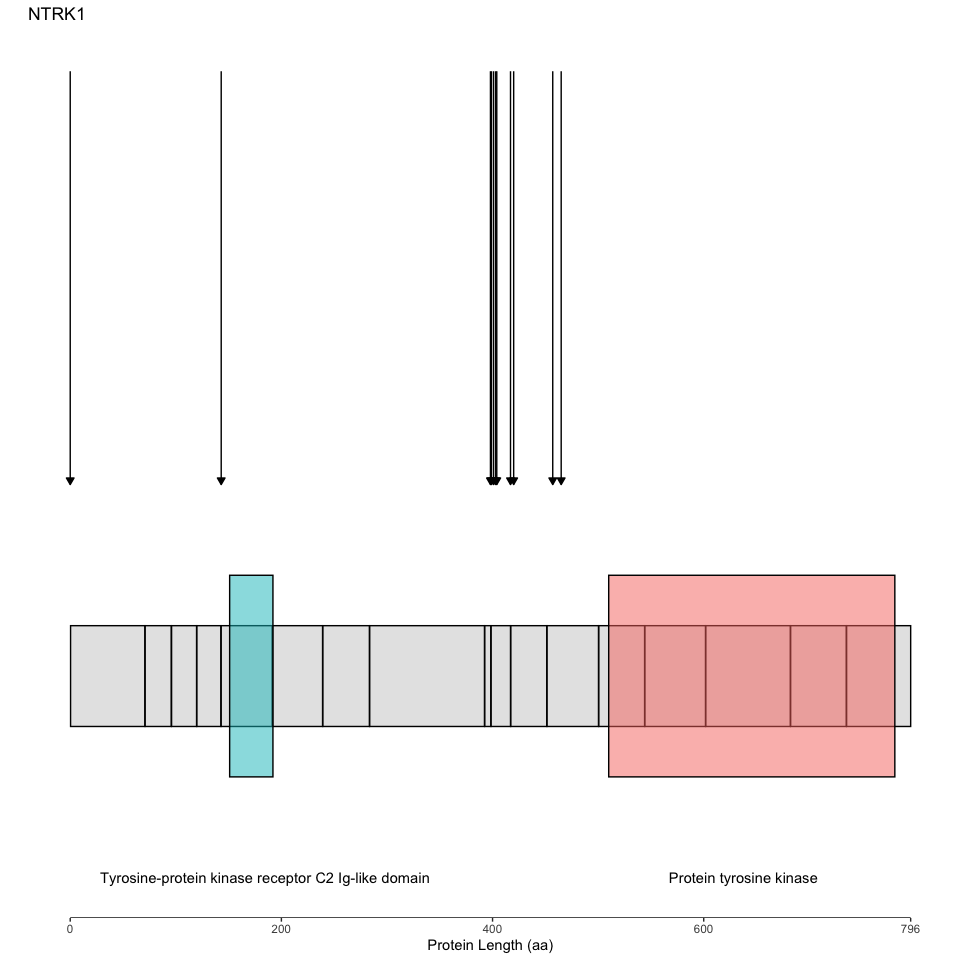<!-- -->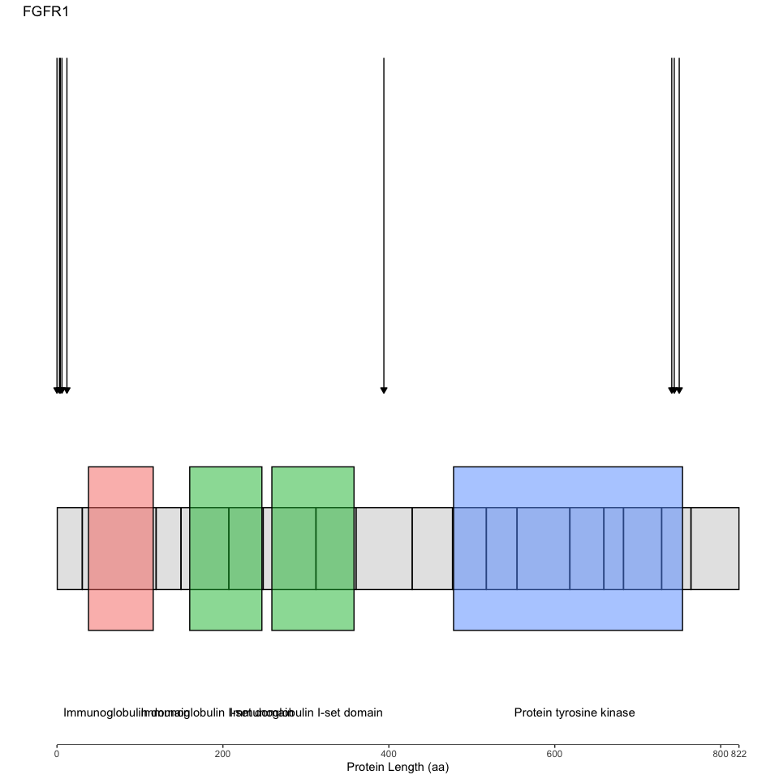<!-- -->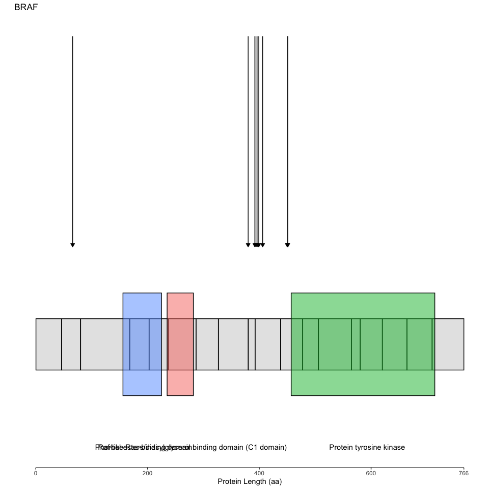<!-- -->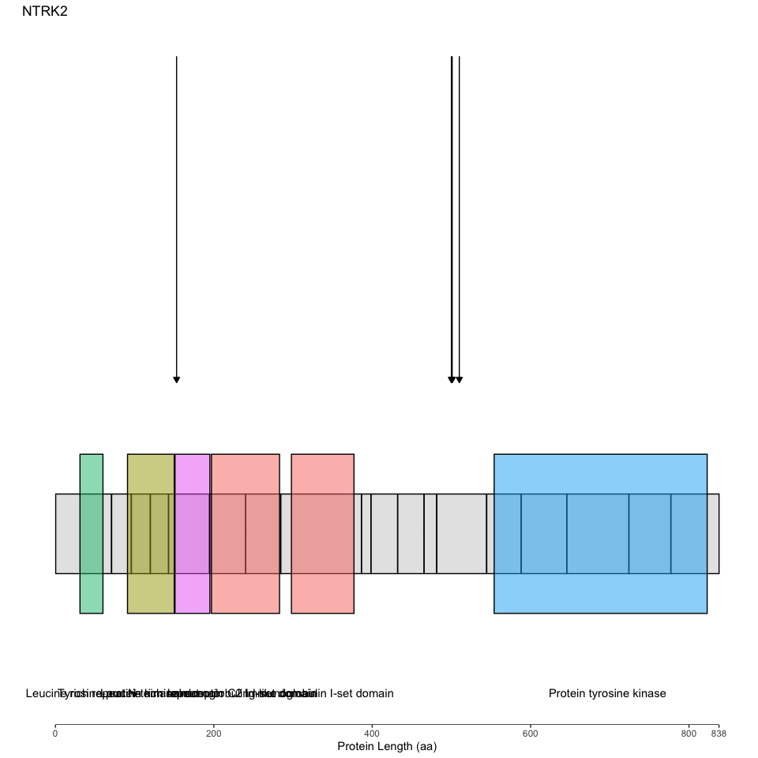<!-- -->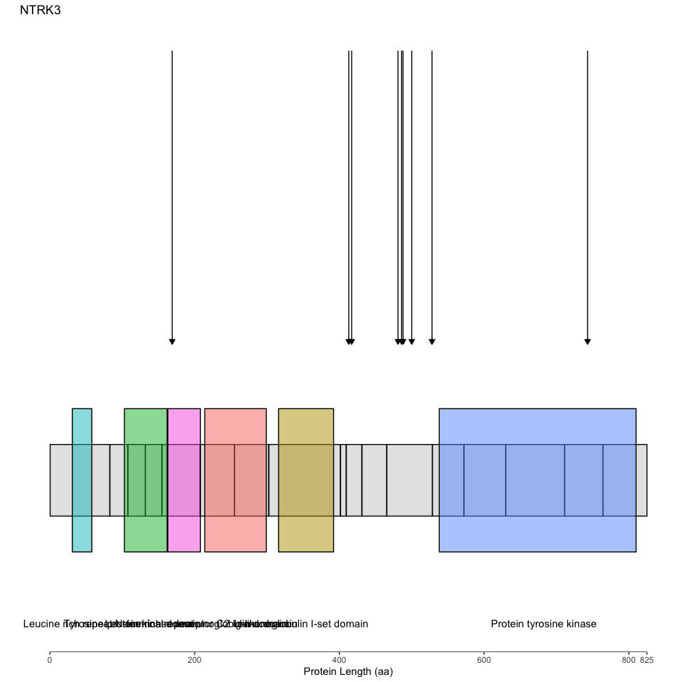<!-- -->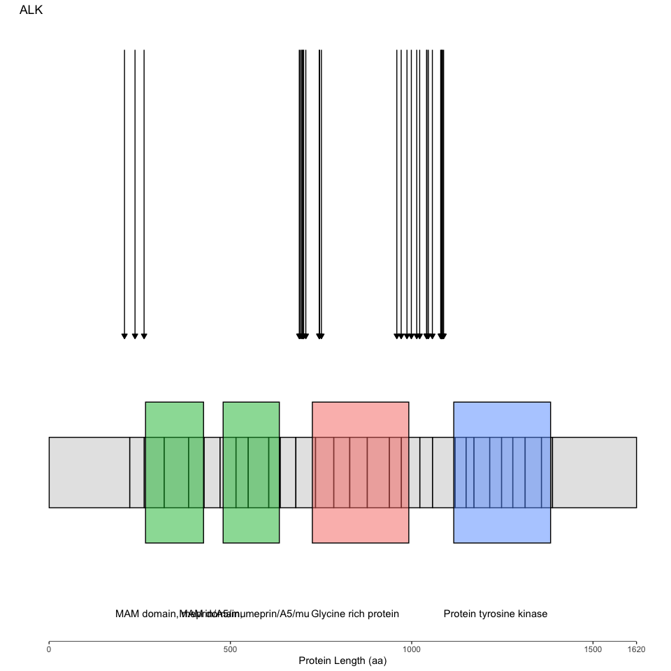<!-- -->

FIG3B

``` r
dat <- read.table("src/fig3b_data.txt", sep = "\t", header = T, row.names = NULL)
protein_info <- read.table("src/fig3_protein_data.txt", sep = "\t", header = T, row.names = NULL) %>% filter( Transcript == 'NM_004304' )

p <- ggplot() + 
  geom_point() +
  geom_segment(data=dat,
               aes(x=Codon, 
                   xend=Codon, 
                   y=(-1*max(dat$value)/10+max(dat$value)/25-1*max(dat$value)/10+max(dat$value)/25)/2, 
                   yend=value), 
               color="grey") +
  geom_point(data=dat, 
             aes(x=Codon, 
                 y=value,
                 color=Partner), 
             size=2) +
  geom_text_repel(data=dat,aes(x=Codon, y=value, label = Partner,hjust="left",vjust="bottom"),angle=45,max.iter = 3e3)+
  geom_segment(data = temp2,
               aes(x = 0, xend = Protein.Length, 
                   y = -1*max(dat$value)/10+max(dat$value)/25, 
                   yend = -1*max(dat$value)/10+max(dat$value)/25), 
               color = 'gray70', size = 2) +
  geom_rect(data = temp2[temp2$Name=='exon',], 
            aes(xmin = Domain.Start, 
                xmax = Domain.End, 
                ymin = -1*max(dat$value)/12.5, 
                ymax = -1*max(dat$value)/12.5 +max(dat$value)/25, 
                ),fill = "grey90",color="black") +
  geom_rect(data = protein_info[protein_info$Name!='exon',], 
      aes(xmin = Domain.Start, 
          xmax = Domain.End, 
          ymin = -1*max(dat$value)/10, 
          ymax = -1*max(dat$value)/10+max(dat$value)/12.5, 
          fill = Full.Name),alpha=0.5,color="black") +
  geom_text_repel(data = protein_info[protein_info$Name!='exon',], 
            aes(x = Text.x, 
                y = (-1*max(dat$value)/10)*1.1, 
                label = Full.Name),direction="x",force = 0.0037,max.iter = 3e3)+
  theme_bw() +
  theme(panel.border = element_blank(),
       panel.grid.major = element_blank(),
       panel.grid.minor = element_blank(),
       legend.position = "none") +
  base_breaks_x(seq(0,max(protein_info$Protein.Length))) +
  base_breaks_y(seq(0,max(dat$value))) +
  ylab("Mutational Count") +
  xlab("Protein Length (aa)") + 
labs(title="ALK")

plot(p)
```

    ## Warning: Use of `dat$value` is discouraged. Use `value` instead.

    ## Warning: Use of `dat$value` is discouraged. Use `value` instead.

    ## Warning: Use of `dat$value` is discouraged. Use `value` instead.

    ## Warning: Use of `dat$value` is discouraged. Use `value` instead.

    ## Warning: ggrepel: 2 unlabeled data points (too many overlaps). Consider
    ## increasing max.overlaps

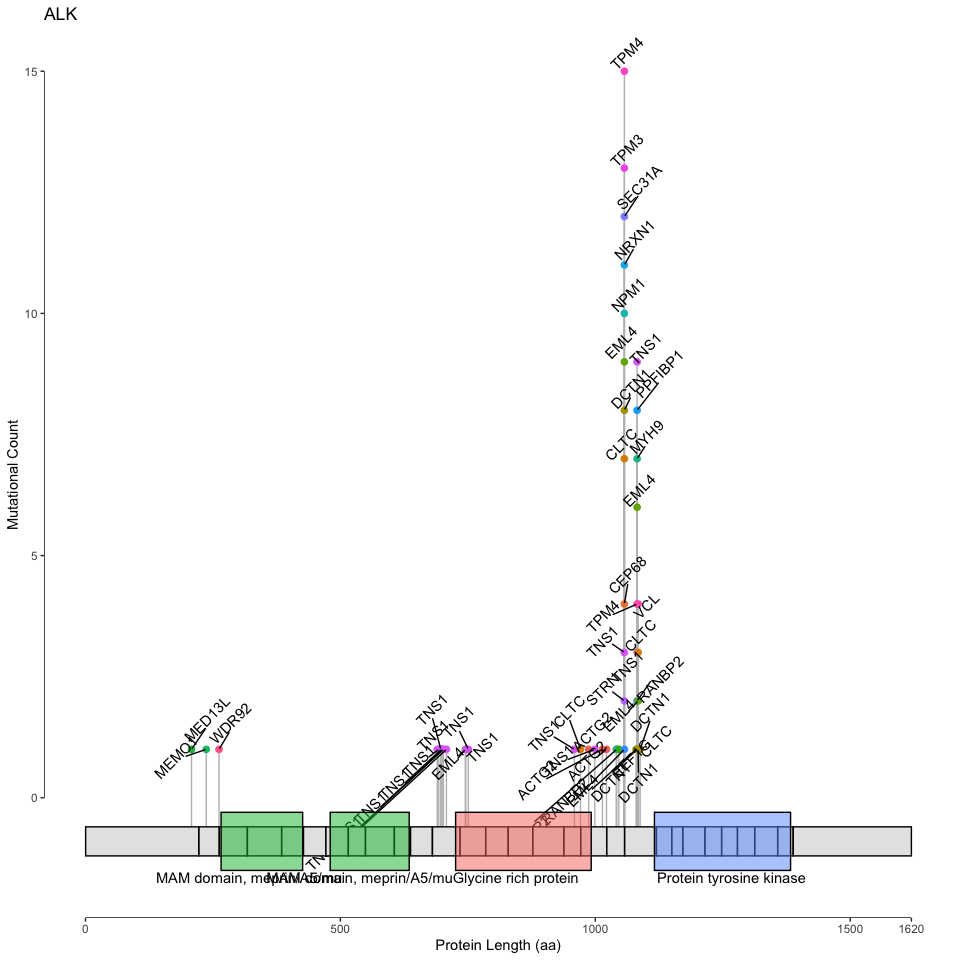<!-- -->

FIG4A

``` r
dat <- read.table(file="src/fig4a_data.txt", header=T, sep="\t", strip.white=T, na.strings=c("","NA","N/A"))

dat$final_disease<-factor(dat$final_disease)
colorList<-c("bone"="#64CCC9", "soft tissue sarcoma"="#FF4C00", "other"="#435363")
ordered_DO = with(dat, reorder(final_disease, gLOH, median))

p <- ggplot(dat, aes(ordered_DO, gLOH, fill=group)) +
  stat_boxplot(geom="errorbar", width=0.25)+ 
  geom_boxplot( outlier.alpha = 0.5, outlier.size = 0.25, outlier.stroke = 0.25) +
  theme_minimal()+
  scale_fill_manual(values=c("Bone"="#64CCC9", "Soft Tissue"="#FF4C00", "Other"="#435363"), name="Group") +
  scale_color_manual(values=c("Bone"="#64CCC9", "Soft Tissue"="#FF4C00", "Other"="#435363"), name="Group") +
  ylab("Percent genome under LOH")+
  theme(axis.text=element_text(size=12),
        axis.title.x = element_blank(),
        axis.text.x=element_text(angle=90, size=12,colour="black", hjust=1,vjust=0.5),
          panel.border = element_rect(fill = NA, colour="black"),
        panel.grid = element_blank()) +
  geom_hline( yintercept = 19.29978, linetype = "dashed" )

plot(p)
```

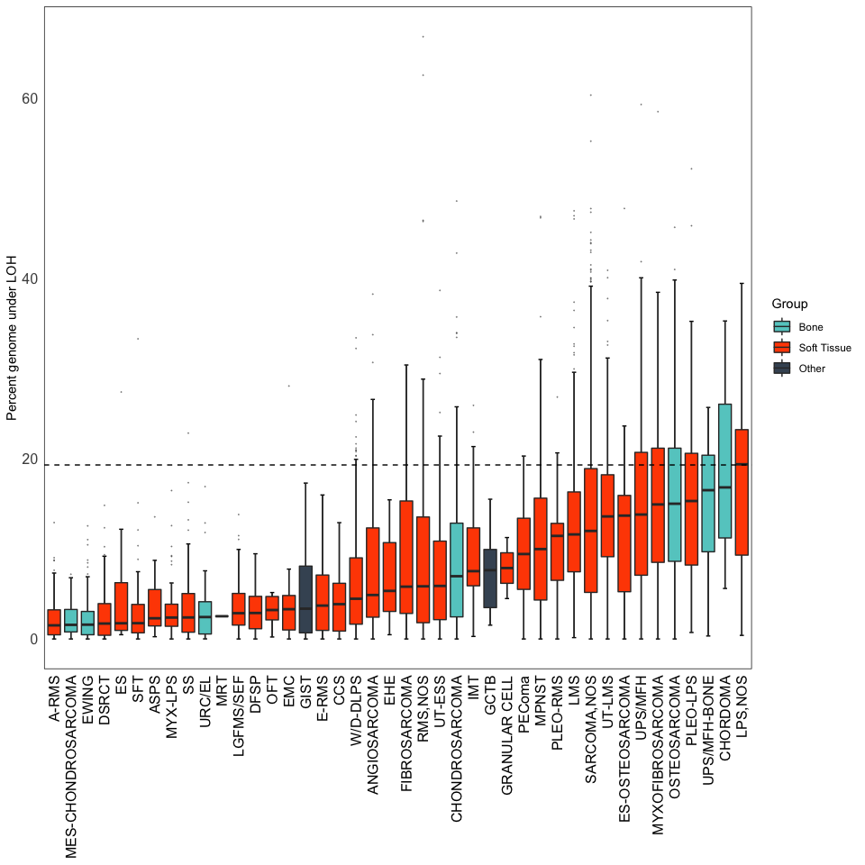<!-- -->

FIG4B

``` r
dat <- read.table(file="src/fig4b_data.txt",sep="\t",stringsAsFactors=FALSE,row.names=NULL,header=TRUE)
dat$TMB[dat$TMB==0]=0.1


p <- ggplot(dat, aes(x=reorder_within(final_disease,TMB,translocation_association,median), y=TMB,  fill=PAYA_or_adult, position = PAYA_or_adult)) +
  geom_boxplot( outlier.alpha = 0.5, outlier.size = 0.25, outlier.stroke = 0.25, position = position_dodge2(width=0.4, preserve = "single", padding = 0.2)) +
  stat_summary(fun.data = give.n, geom = "text", fun.y = median,position = position_dodge(width = 0.75))+
  scale_y_log10(breaks=c(0, 1, 10, 20, 100, 1000))+
  coord_trans() + 
  theme_minimal()+
  scale_x_reordered()+
  facet_grid(.~translocation_association, scale="free_x", space = "free_x") + 
  geom_hline(yintercept = median(dat$TMB),linetype="dashed") + 
  theme(axis.text=element_text(size=fontsize),
        axis.title.x = element_blank(),
        axis.text.x=element_text(angle=90, size=12,colour="black", hjust=1, vjust = 0.5),
          panel.border = element_rect(fill = NA, colour="black"),
        panel.grid = element_blank()) 
```

    ## Warning: `fun.y` is deprecated. Use `fun` instead.

``` r
plot(p)
```

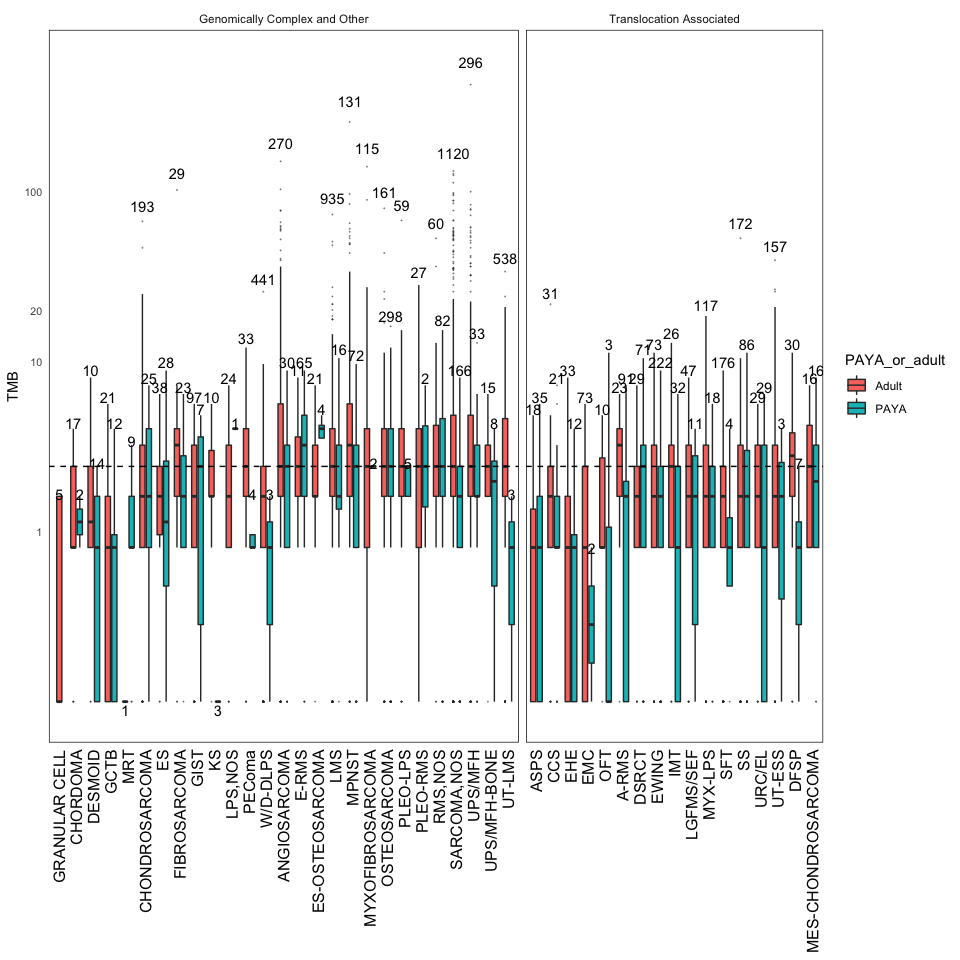<!-- -->

FIG4C

``` r
dat <- read.table(file="src/fig4c_data.txt",sep="\t",stringsAsFactors=FALSE,row.names=NULL,header=TRUE)

dat$TMB[dat$TMB == 0] <- 0.1
dat <- dat[order(dat$MMRD.or.HRD,decreasing = T),]

p <- ggplot(data= dat, aes(x = TMB, y = gLOH/100, color = MMRD.or.HRD)) + 
  geom_point(alpha = 0.5, size = 1) + 
  theme_classic() + 
  theme(legend.position="right",
      legend.title = element_text(size=fontsize),
      legend.text = element_text(size=fontsize),
      axis.title=element_text(size=fontsize*1.25),
      axis.text.x=element_text(size=fontsize,colour="black"),
      axis.text.y=element_text(size=fontsize,colour="black")) +
  scale_x_log10() + 
  scale_color_manual(values= c("Both"="green",
                               "Neither"= "#8B99A6",
                               "MMRD"="blue",
                               "HRD"="red"),
                     name="Mismatch Repair/\nHomologous Recombination\npathway status") + 
  scale_y_continuous(expand=c(0,0), limits = c(0,0.7), labels = scales::percent_format()) + 
  ylab( "percent genome under LOH") + 
  xlab( "TMB (mut/Mb)") + 
  geom_hline(yintercept = 0.1929978, linetype = "dashed") + 
  geom_vline(xintercept = 10, linetype = "dashed") + 
  guides(col=guide_legend(ncol=1,byrow=TRUE, size = 30))

plot(p)
```

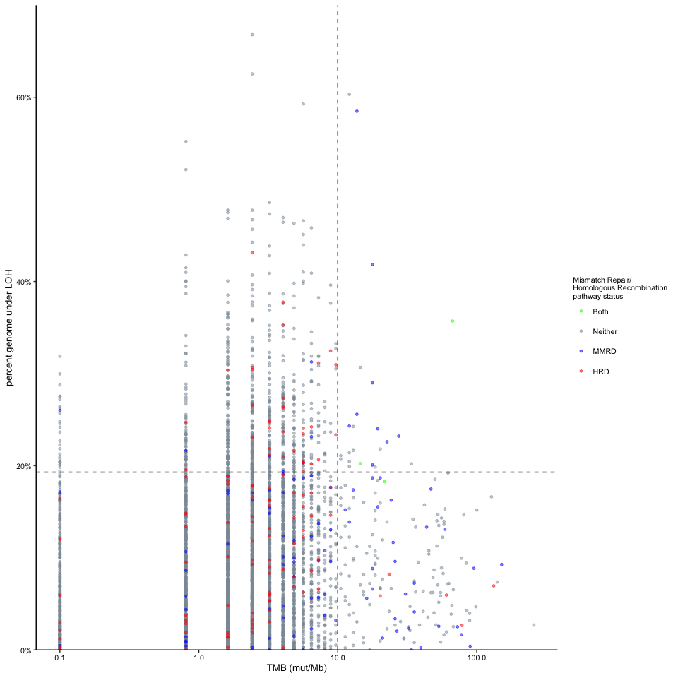<!-- -->

FIG5A

``` r
longtail_data <- read.delim( "src/fig5a_data.txt" )
longtail_data$Disease <-factor(longtail_data$Disease, levels=unique(longtail_data$Disease[order(longtail_data$NonePercent, decreasing=TRUE)]))
longtail_data$Signature<-factor(longtail_data$Signature, levels=c("None",  "Aging", "Alkylating", "APOBEC", "BRCA", "MMR", "POLE", "Tobacco", "UV"))


colorList <- c("None"="#8B99A6","Aging"="salmon","Alkylating"="deeppink","APOBEC"="skyblue","BRCA"="steelblue4","MMR"="gold3","POLE"="red","Tobacco"="blue","UV"="yellow")

p <- ggplot() + 
  geom_bar(aes(y = Percent, x = Disease, fill = Signature), data = longtail_data,stat="identity")  + 
  ylab("Incidence (%)") +
  theme(plot.title=element_text(size = fontsize, hjust=0.5),
        legend.position = "right",
        text=element_text(size = fontsize),
        axis.ticks=element_blank(),
        strip.background = element_rect(fill="white"),
        axis.text.x=element_text(colour="black", size = fontsize, angle=0, hjust=1),
        axis.text.y=element_text(colour="black", size = fontsize)) +
  scale_fill_manual(values = colorList, name = "") +
  xlab("") +
  coord_flip(ylim=c(0,20))

plot( p ) 
```

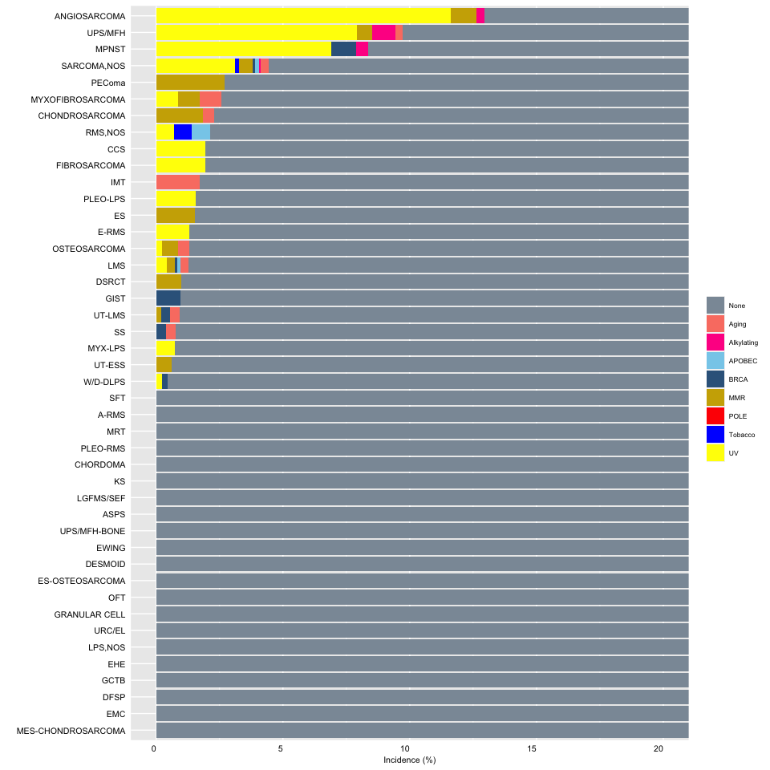<!-- -->

FIG5B

``` r
longtail_data <- read.delim("src/fig5b_data.txt")
fontsize = 4
longtail_data$Disease <-factor(longtail_data$Disease, levels=unique(longtail_data$Disease[order(longtail_data$Overall_Percent, decreasing=TRUE)]))
longtail_data$Actionability<-factor(longtail_data$Actionability, levels=c("","FDA-recognized Biomarker","Standard Care Biomarker","Clinical Evidence Biomarker","Out of indication Clinical Biomarker","Biological Evidence Biomarker","Standard Care Resistance","Clinical Evidence Resistance"))

p <- ggplot() + 
  geom_bar(aes(y = Percent, x = Disease, fill = Actionability), data = longtail_data,stat="identity")  + 
  ylab("Incidence (%)") +
  scale_y_continuous(expand = c(0,0), limits = c(0, 101)) +
  theme_classic()+
  theme(legend.position = "right",
        text=element_text(size = fontsize),
        axis.ticks=element_blank(),
        strip.background = element_rect(fill="white"),
        axis.text.x=element_text(colour="black", size = fontsize, angle=0, hjust=1),
        axis.text.y=element_text(colour="black", size = )) +
  scale_fill_manual(values = c("FDA-recognized Biomarker"="#4F944E", 
                               "Standard Care Biomarker"="#3A6E9C", 
                               "Clinical Evidence Biomarker"="#814F88", 
                               "Out of indication Clinical Biomarker"="#AC8FB2", 
                               "Biological Evidence Biomarker"="#3D3E3A", 
                               "Standard Care Resistance"="#CA4637", 
                               "Clinical Evidence Resistance"="#DE968D"), 
                    name = "OncoKB Level",
                    na.value = NA) +
  xlab("") + 
  coord_flip()

plot(p)
```

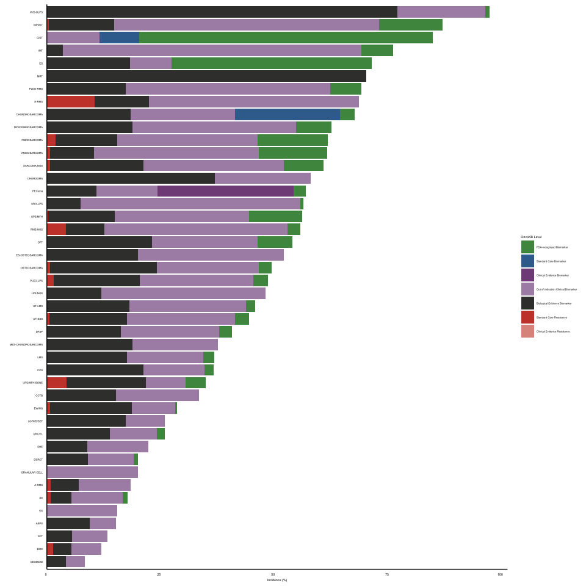<!-- -->

``` r
sessionInfo()
```

    ## R version 4.1.1 (2021-08-10)
    ## Platform: x86_64-apple-darwin17.0 (64-bit)
    ## Running under: macOS Mojave 10.14.6
    ## 
    ## Matrix products: default
    ## BLAS:   /Library/Frameworks/R.framework/Versions/4.1/Resources/lib/libRblas.0.dylib
    ## LAPACK: /Library/Frameworks/R.framework/Versions/4.1/Resources/lib/libRlapack.dylib
    ## 
    ## locale:
    ## [1] en_US.UTF-8/en_US.UTF-8/en_US.UTF-8/C/en_US.UTF-8/en_US.UTF-8
    ## 
    ## attached base packages:
    ## [1] grid      stats     graphics  grDevices utils     datasets  methods  
    ## [8] base     
    ## 
    ## other attached packages:
    ##  [1] egg_0.4.5         gridExtra_2.3     ggalluvial_0.12.3 ggridges_0.5.3   
    ##  [5] stringr_1.4.0     readxl_1.3.1      reshape2_1.4.4    ggrepel_0.9.1    
    ##  [9] ggplot2_3.3.5     dplyr_1.0.7      
    ## 
    ## loaded via a namespace (and not attached):
    ##  [1] Rcpp_1.0.7       highr_0.9        cellranger_1.1.0 plyr_1.8.6      
    ##  [5] pillar_1.6.2     compiler_4.1.1   tools_4.1.1      digest_0.6.27   
    ##  [9] evaluate_0.14    lifecycle_1.0.0  tibble_3.1.4     gtable_0.3.0    
    ## [13] pkgconfig_2.0.3  rlang_0.4.11     DBI_1.1.1        yaml_2.2.1      
    ## [17] xfun_0.25        fastmap_1.1.0    withr_2.4.2      knitr_1.33      
    ## [21] generics_0.1.0   vctrs_0.3.8      tidyselect_1.1.1 glue_1.4.2      
    ## [25] R6_2.5.1         fansi_0.5.0      rmarkdown_2.10   tidyr_1.1.3     
    ## [29] farver_2.1.0     purrr_0.3.4      magrittr_2.0.1   scales_1.1.1    
    ## [33] ellipsis_0.3.2   htmltools_0.5.2  assertthat_0.2.1 colorspace_2.0-2
    ## [37] labeling_0.4.2   utf8_1.2.2       stringi_1.7.4    munsell_0.5.0   
    ## [41] crayon_1.4.1
